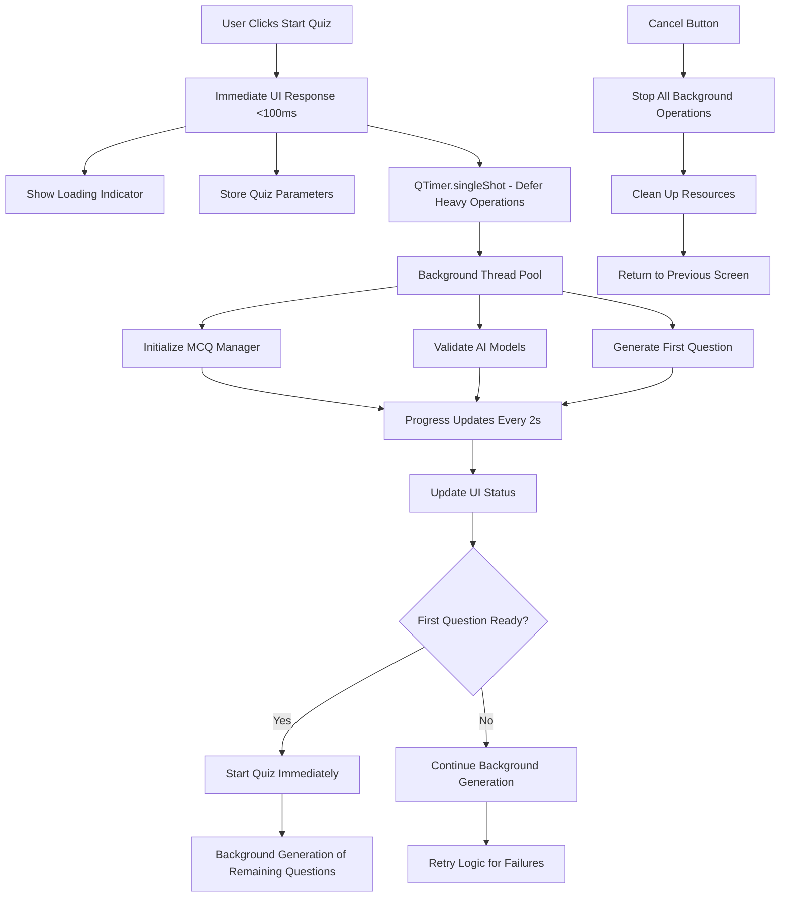

# Design Document

## Overview

The quiz freeze fix addresses the critical UI blocking issue in the Knowledge App by implementing a comprehensive asynchronous architecture. The solution moves all heavy operations off the main UI thread while providing immediate user feedback and robust error handling. The design ensures the application remains responsive under all conditions while maintaining the existing pure AI generation functionality.

## Architecture

### Current Problem Analysis

The current `startQuiz` method in `webengine_app.py` performs multiple blocking operations on the main UI thread:

1. **MCQ Manager Initialization** - Heavy model loading and setup
2. **AI Model Validation** - Checking Ollama/LM Studio availability  
3. **Question Generation** - Synchronous AI inference calls
4. **Resource Allocation** - Memory and GPU resource setup

These operations can take 10-60+ seconds, during which the UI becomes completely unresponsive.

### New Asynchronous Architecture



## Components and Interfaces

### 1. AsyncQuizInitializer

**Purpose**: Manages the complete quiz initialization process asynchronously

**Key Methods**:
```python
class AsyncQuizInitializer:
    def __init__(self, bridge: PythonBridge):
        self.bridge = bridge
        self.cancellation_token = threading.Event()
        self.progress_callback = None
        
    async def initialize_quiz_async(self, quiz_params: dict) -> bool:
        """Main async initialization method"""
        
    def cancel_initialization(self):
        """Cancel all ongoing operations"""
        
    def set_progress_callback(self, callback):
        """Set callback for progress updates"""
```

### 2. ResponsiveProgressManager

**Purpose**: Provides real-time progress updates without blocking the UI

**Key Methods**:
```python
class ResponsiveProgressManager:
    def __init__(self, update_callback):
        self.update_callback = update_callback
        self.progress_timer = None
        self.stage_messages = []
        
    def start_monitoring(self, stages: List[str]):
        """Start progress monitoring with defined stages"""
        
    def update_stage(self, stage: str, elapsed_time: float):
        """Update current stage with timing info"""
        
    def stop_monitoring(self):
        """Stop all progress monitoring"""
```

### 3. ThreadSafeQuestionBuffer

**Purpose**: Manages question generation and buffering in background threads

**Key Methods**:
```python
class ThreadSafeQuestionBuffer:
    def __init__(self, mcq_manager):
        self.mcq_manager = mcq_manager
        self.buffer = queue.Queue()
        self.generation_lock = threading.RLock()
        
    async def generate_question_async(self, params: dict) -> dict:
        """Generate single question asynchronously"""
        
    def get_next_question(self) -> Optional[dict]:
        """Get next question from buffer (non-blocking)"""
        
    def start_background_generation(self, params: dict, count: int):
        """Start generating multiple questions in background"""
```

### 4. Enhanced PythonBridge Methods

**Modified startQuiz Method**:
```python
@pyqtSlot(str)
def startQuiz(self, params):
    """🚀 INSTANT QUIZ START - Zero blocking operations"""
    try:
        # 1. Immediate UI response (<50ms)
        quiz_params = json.loads(params)
        self._show_immediate_loading_state(quiz_params)
        
        # 2. Defer all heavy operations via QTimer
        QTimer.singleShot(10, lambda: self._start_async_initialization(quiz_params))
        
    except Exception as e:
        self.errorOccurred.emit(f"Failed to start quiz: {str(e)}")

def _start_async_initialization(self, quiz_params):
    """Start async initialization with progress monitoring"""
    # Initialize AsyncQuizInitializer
    # Start ResponsiveProgressManager  
    # Begin background operations
```

## Data Models

### QuizInitializationState

```python
@dataclass
class QuizInitializationState:
    quiz_id: str
    topic: str
    difficulty: str
    mode: str
    num_questions: int
    
    # Progress tracking
    current_stage: str
    stages_completed: List[str]
    start_time: float
    estimated_completion: Optional[float]
    
    # Resource management
    mcq_manager_ready: bool
    first_question_ready: bool
    cancellation_requested: bool
    
    # Error handling
    last_error: Optional[str]
    retry_count: int
    max_retries: int = 3
```

### ProgressUpdate

```python
@dataclass
class ProgressUpdate:
    stage: str
    message: str
    elapsed_time: float
    estimated_remaining: Optional[float]
    percentage_complete: Optional[int]
    can_cancel: bool = True
```

## Error Handling

### 1. Graceful Degradation Strategy

- **MCQ Manager Initialization Failure**: Retry with exponential backoff (1s, 2s, 4s)
- **AI Model Unavailable**: Show clear error with setup instructions
- **Question Generation Timeout**: Retry with different parameters
- **Memory/Resource Issues**: Clean up and restart with reduced settings

### 2. User-Friendly Error Messages

```python
ERROR_MESSAGES = {
    "mcq_manager_timeout": {
        "title": "AI System Loading",
        "message": "The AI system is taking longer than usual to load. This is normal on first startup.",
        "actions": ["Wait", "Cancel", "Retry"]
    },
    "offline_mode_unavailable": {
        "title": "Offline Mode Not Available", 
        "message": "Local AI setup required for offline mode.",
        "actions": ["Setup Guide", "Switch to Online", "Cancel"]
    },
    "question_generation_failed": {
        "title": "Question Generation Failed",
        "message": "Unable to generate questions. Retrying automatically...",
        "actions": ["Cancel", "Change Topic"]
    }
}
```

### 3. Automatic Recovery Mechanisms

- **Connection Retry**: Automatic retry for network/API failures
- **Resource Cleanup**: Automatic cleanup of failed initialization attempts
- **Fallback Strategies**: Graceful handling when preferred AI models are unavailable

## Testing Strategy

### 1. UI Responsiveness Tests

```python
def test_quiz_start_responsiveness():
    """Test that UI remains responsive during quiz start"""
    start_time = time.time()
    bridge.startQuiz(json.dumps(quiz_params))
    
    # UI should respond within 100ms
    response_time = time.time() - start_time
    assert response_time < 0.1, f"UI response too slow: {response_time}s"
    
    # Should be able to interact with UI immediately
    assert can_interact_with_ui(), "UI is frozen"
```

### 2. Cancellation Tests

```python
def test_quiz_initialization_cancellation():
    """Test that quiz initialization can be cancelled"""
    bridge.startQuiz(json.dumps(quiz_params))
    time.sleep(1)  # Let initialization start
    
    bridge.cancelQuizInitialization()
    
    # Should cancel within 2 seconds
    assert wait_for_cancellation(timeout=2), "Cancellation took too long"
    assert all_background_threads_stopped(), "Background threads still running"
```

### 3. Progress Update Tests

```python
def test_progress_updates():
    """Test that progress updates are provided regularly"""
    progress_updates = []
    
    def capture_progress(update):
        progress_updates.append(update)
    
    bridge.progressUpdate.connect(capture_progress)
    bridge.startQuiz(json.dumps(quiz_params))
    
    # Should receive progress updates within 3 seconds
    time.sleep(3)
    assert len(progress_updates) > 0, "No progress updates received"
    
    # Updates should be regular (every 2-3 seconds)
    time_gaps = [updates[i+1].timestamp - updates[i].timestamp 
                for i in range(len(progress_updates)-1)]
    assert all(gap < 4 for gap in time_gaps), "Progress updates too infrequent"
```

### 4. Memory and Resource Tests

```python
def test_resource_cleanup_on_cancellation():
    """Test that resources are properly cleaned up when cancelled"""
    initial_memory = get_memory_usage()
    
    bridge.startQuiz(json.dumps(quiz_params))
    time.sleep(2)
    bridge.cancelQuizInitialization()
    time.sleep(1)
    
    final_memory = get_memory_usage()
    memory_leak = final_memory - initial_memory
    
    assert memory_leak < 50_000_000, f"Memory leak detected: {memory_leak} bytes"
```

### 5. Integration Tests

```python
def test_end_to_end_quiz_flow():
    """Test complete quiz flow from start to first question"""
    quiz_started = threading.Event()
    first_question_received = threading.Event()
    
    def on_quiz_started():
        quiz_started.set()
        
    def on_question_received(question):
        first_question_received.set()
    
    bridge.quizStarted.connect(on_quiz_started)
    bridge.questionReceived.connect(on_question_received)
    
    bridge.startQuiz(json.dumps(quiz_params))
    
    # Quiz should start within reasonable time
    assert quiz_started.wait(timeout=30), "Quiz failed to start"
    assert first_question_received.wait(timeout=60), "First question not received"
```

## Implementation Phases

### Phase 1: Core Async Infrastructure
- Implement AsyncQuizInitializer
- Add QTimer-based operation deferral
- Create ThreadSafeQuestionBuffer
- Basic progress monitoring

### Phase 2: Enhanced User Experience  
- Implement ResponsiveProgressManager
- Add cancellation functionality
- Enhanced error messages and recovery
- Progress percentage calculations

### Phase 3: Optimization and Polish
- Memory usage optimization
- Performance monitoring
- Advanced retry strategies
- Comprehensive testing suite